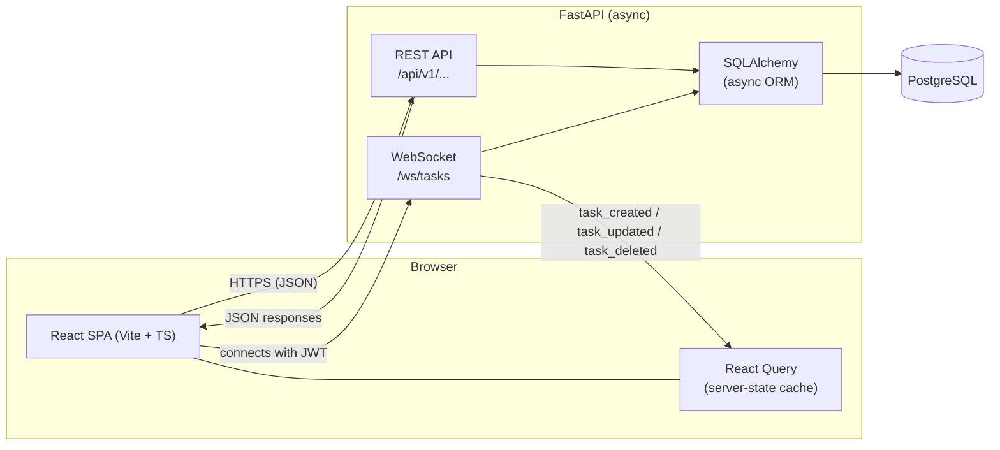
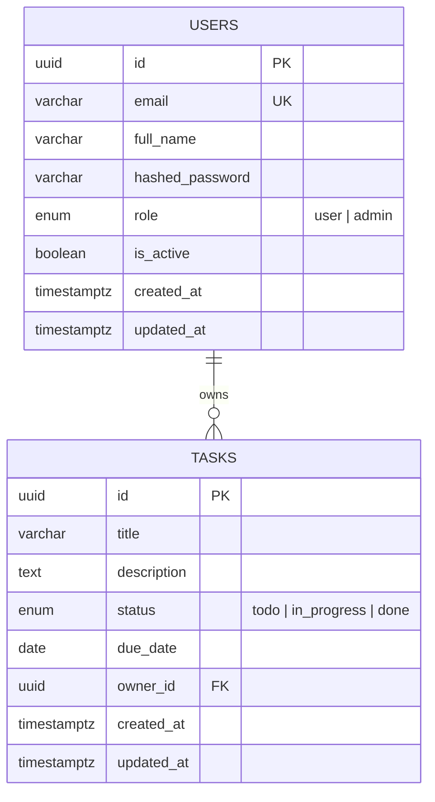
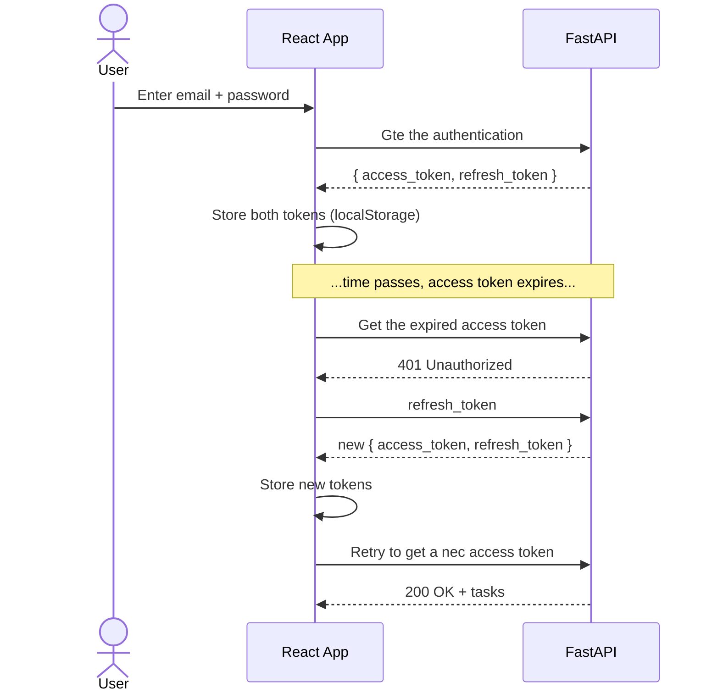
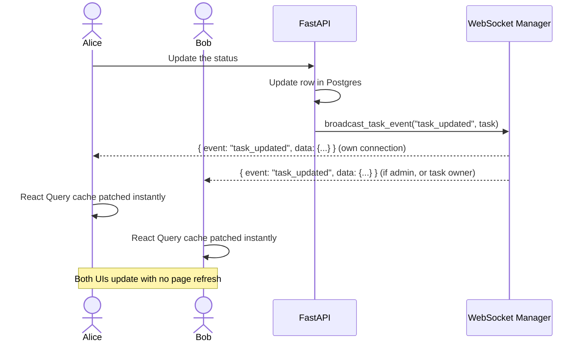
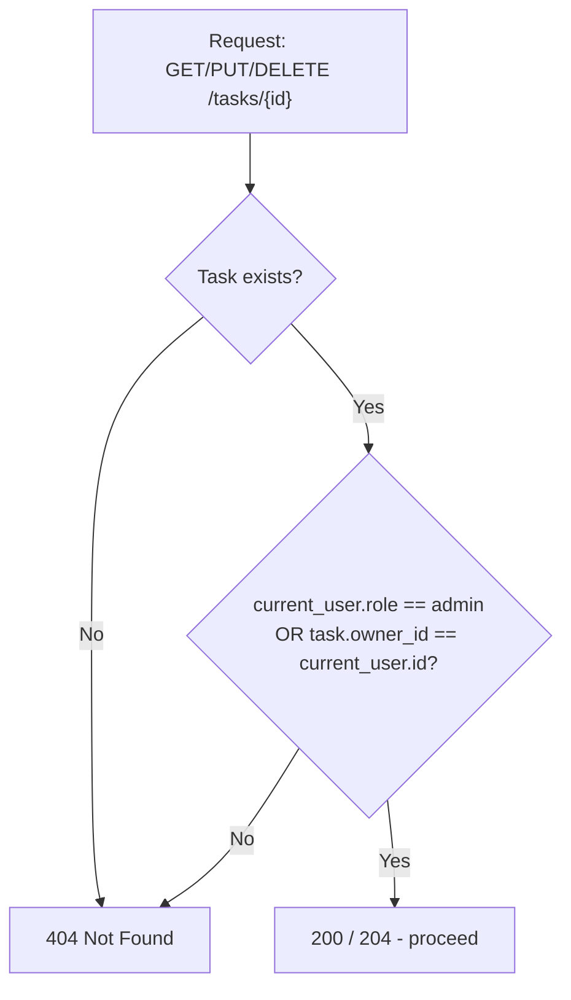

# Task Tracker Application

A full-stack task management application with role-based access control and
real-time updates, built for the Software Engineer (Full Stack — Backend
Focused) take-home assignment.

**Stack:** FastAPI (Python) · React + TypeScript · PostgreSQL · WebSockets

---

## Contents

- [Quick Start](#quick-start)
- [Manual Setup](#manual-setup)
- [Architecture](#architecture)
- [Database Schema](#database-schema)
- [Key Flows](#key-flows)
- [Design Decisions](#design-decisions)
- [Assumptions](#assumptions)
- [Future Improvements](#future-improvements)
- [Testing](#testing)
- [API Documentation](#api-documentation)
- [Project Structure](#project-structure)

---

## Quick Start

The fastest way to run the whole stack:

```bash
docker-compose up --build
```

- Frontend: http://localhost:8080
- Backend API: http://localhost:8000
- Swagger docs: http://localhost:8000/docs

The backend container runs Alembic migrations automatically on startup, so
the database is ready to use immediately — no manual setup required.

> **Note on Docker:** the Dockerfiles and `docker-compose.yml` were written
> and syntax-validated, but the development sandbox used to build this
> project did not have a Docker daemon available to run a full
> `docker-compose up` end-to-end. Backend and frontend were each verified
> thoroughly in isolation (see [Testing](#testing)). Please flag it if you
> hit any container-specific issue — it's the one part of this submission
> I couldn't personally verify start-to-finish.

## Manual Setup

If you'd rather run things natively (e.g. for active development):

### 1. Database

```bash
docker-compose up -d postgres
```

Or point `DATABASE_URL` in `backend/.env` at any Postgres 16 instance you
already have running.

### 2. Backend

```bash
cd backend
python3 -m venv venv && source venv/bin/activate
pip install -r requirements.txt
cp .env.example .env
alembic upgrade head
uvicorn app.main:app --reload
```

Full backend details (testing, linting, raw-SQL verification) are in
[`backend/README.md`](backend/README.md).

### 3. Frontend

```bash
cd frontend
npm install
cp .env.example .env
npm run dev
```

Visit http://localhost:5173.

### Getting an admin account

There's intentionally no self-serve "become admin" endpoint (see
[Design Decisions](#design-decisions)). Register a normal account, then
promote it directly in the database:

```bash
# If running Postgres via Docker:
docker exec -it tasktracker_postgres psql -U tasktracker -d tasktracker \
  -c "UPDATE users SET role = 'admin' WHERE email = 'you@example.com';"
```

Log out and back in afterward — the role is embedded in the JWT at login
time, so an already-issued token won't reflect the change.

---

## Architecture



- **Backend** exposes a REST API (`/api/v1/...`) plus a WebSocket endpoint
  (`/ws/tasks`) for live updates. See `backend/README.md` for the full
  request/response contract and internal module layout.
- **Frontend** is a single-page app. React Query owns all server state
  (task lists, pagination, caching, refetching); the WebSocket hook patches
  that same cache directly when a live event arrives, so the UI updates
  without polling.
- **Auth** is JWT-based: a short-lived access token authenticates API and
  WebSocket requests, and a longer-lived refresh token (used only against
  `/api/v1/auth/refresh`) lets the frontend transparently get a new access
  token when the old one expires, via an axios response interceptor.

## Database Schema



Schema is managed exclusively via Alembic migrations
(`backend/alembic/versions/`). `db-scripts/schema.sql` and
`db-scripts/verify.sql` are plain-SQL references for manual inspection —
see `db-scripts/verify.sql` for copy-pasteable queries that check table
structure, enum values, foreign keys, indexes, and row counts against a
running database.

## Key Flows

### Login, and transparent token refresh

This is the part most likely to look "magic" from the frontend code alone,
so it's worth seeing as a sequence:



If the refresh call *itself* fails (refresh token also expired/invalid),
the frontend clears both tokens and redirects to `/login` — see the axios
interceptor in `frontend/src/api/client.ts`.

### Real-time task updates



The WebSocket manager (`backend/app/ws/manager.py`) sends each event only
to the task's owner and to any connected admins — the same visibility
rule enforced on the REST endpoints, applied consistently to real-time
events too.

### RBAC decision path (task access)



Unauthorized access returns the *same* 404 as a genuinely missing task —
deliberately, so a user can't distinguish "this task doesn't exist" from
"this task exists but isn't yours" (see Design Decisions).

---

## Design Decisions

### Backend
See [`backend/README.md`](backend/README.md#design-decisions) for the full
list (RBAC enforcement at the query level, 404-not-403 for unauthorized
task access, DB-only admin promotion, portable UUID type for testing, etc).

### Frontend

- **React Query over Redux/manual state.** Task data is fundamentally
  server state (fetched, cached, occasionally stale, invalidated on
  mutation) rather than client state. React Query models that directly —
  pagination, loading/error states, and cache invalidation on
  create/update/delete all come for close to free, and it composes cleanly
  with the WebSocket layer instead of fighting it.
- **WebSocket events patch the React Query cache directly**, rather than
  each component managing its own "is this stale?" logic. A `task_updated`
  event calls `queryClient.setQueriesData` to update any cached page that
  already contains that task, then calls `invalidateQueries` as a
  correctness backstop (e.g. if a status change should move a task to a
  different page, the targeted patch won't catch that, but the
  invalidation-triggered refetch will).
- **Tokens live in `localStorage`**, not React state alone, so a page
  refresh doesn't force a re-login. This is a deliberate, documented
  tradeoff — see Assumptions below.
- **A single `tokenStorage` module** is the only thing that touches
  `localStorage` directly. Every other module goes through it, so moving to
  httpOnly cookies later is a one-file change, not a codebase-wide one.
- **RBAC-aware UI, not just RBAC-aware API.** The "filter by owner"
  dropdown and its backing `/users` query are conditionally rendered/enabled
  only for admins (`enabled: isAdmin` in the React Query hook) — the
  frontend doesn't fire a request it already knows the backend will 403.
- **Ticket-stub task cards.** Given the subject — a *task tracker* — I
  leaned into "ticket" as the visual metaphor: a colored left-edge bar per
  status (like a filing tab) and a monospace due-date (reads like a
  timestamp on a ticket stub), rather than a generic card-with-shadow.

## Assumptions

- **No email verification.** Registered accounts are active immediately.
- **Admin promotion is manual/DB-only** (see backend README) — there's no
  in-app "make this user an admin" button, by design.
- **Task `status` is a fixed enum** (`todo` / `in_progress` / `done`), not
  a free-text or per-user-configurable field.
- **Refresh tokens are stored in `localStorage`**, which is readable by any
  script running on the page (XSS risk) — acceptable for this assignment's
  scope, but the honest tradeoff vs. the more production-appropriate
  approach (httpOnly cookie + in-memory access token) is called out
  explicitly rather than silently assumed. See Future Improvements.
- **Real-time delivery is best-effort.** If a client is offline when an
  event fires, it simply gets the current state on its next fetch/reconnect
  — there's no event replay or missed-message queue.

## Future Improvements

Given more time, in priority order:

1. **Move refresh tokens to an httpOnly cookie** with the access token kept
   in memory only, closing the XSS exposure window described above.
2. **Refresh token rotation + reuse detection** on the backend, so a leaked
   refresh token can be detected and invalidated rather than remaining
   valid until expiry.
3. **Redis-backed WebSocket pub/sub** so real-time updates work correctly
   across multiple backend instances (the current in-memory
   `ConnectionManager` only works for a single process — noted explicitly
   in `backend/app/ws/manager.py`).
4. **Rate limiting** on `/auth/login` and `/auth/register`.
5. **Optimistic UI updates** for create/update/delete (currently the UI
   waits for the server round-trip before showing a change locally; the
   WebSocket event usually arrives fast enough that this isn't very
   noticeable, but it's not instant).
6. **E2E tests with a real browser** (Playwright/Cypress). The frontend
   currently has component-level tests (Vitest + Testing Library + MSW)
   covering forms, auth flows, and error handling, and the backend has
   full integration tests against its API — but nothing drives an actual
   browser through the whole login → create → real-time-update flow.
7. **Task comments/attachments, activity log, bulk actions** — reasonable
   product features that were out of scope for this assignment.

## Testing

```bash
# Backend — 23 tests, integration-style against an in-memory SQLite DB
cd backend && pytest -v

# Frontend — 13 tests, component-level with mocked API (MSW)
cd frontend && npm run test
```

Both suites run in CI on every push/PR (see `.github/workflows/ci.yml`),
alongside linting (`ruff` for the backend, `oxlint` for the frontend) and,
for the frontend, a production build.

## API Documentation

- **Interactive:** http://localhost:8000/docs (Swagger UI, auto-generated
  from the FastAPI route definitions — always in sync with the actual API)
- **Postman:** import `postman/Task-Tracker.postman_collection.json` and
  `postman/Task-Tracker.postman_environment.json`. The collection is
  organized into folders:

  | Folder | Contents |
  |---|---|
  | `Auth` | Register, Login, Refresh — running **Login** auto-saves `access_token`/`refresh_token` into the environment for every later request |
  | `Users` | Get current user (`/me`), list all users (admin only) |
  | `Tasks` | Full CRUD, pagination, filter by status, filter by owner (admin only) |
  | `Error Cases` | Deliberately-invalid requests, so a reviewer can confirm 401/403/404/409/422 responses without constructing them by hand |
  | `Health` | Basic health check |

  Minimal setup for a reviewer: import both files, run `Auth → Register
  User` once, then `Auth → Login`, then anything else in any order. I ran
  the full collection against a live instance while building it (via
  `newman`) to confirm every request returns the status code its name
  promises.

## Project Structure

```
task-tracker/
├── backend/              # FastAPI app — see backend/README.md
├── frontend/              # React app
├── db-scripts/            # Raw SQL: schema.sql (reference) + verify.sql
├── postman/                # Collection + environment
├── .github/workflows/       # CI pipeline
└── docker-compose.yml        # Full stack: postgres + backend + frontend
```
